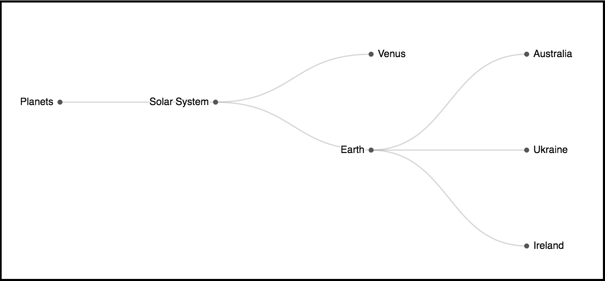

# SimpleTree

A Simple Tree component to display your hierarchical data.

# Usage

ES6 modules

```js
import SimpleTree from '@kuali/simple-tree'
```

CommonJS

```js
var SimpleTree = require('@kuali/simple-tree').default
```

```js
import React from 'react'
import SimpleTree from '@kuali/simple-tree'
import ReactDOM from 'react-dom'

const data = [
  { id: '1', parentId: null, name: 'Solar System' },
  { id: '2', parentId: '1', name: 'Earth' },
  { id: '3', parentId: '1', name: 'Venus' },
  { id: '4', parentId: '2', name: 'Australia' },
  { id: '5', parentId: '2', name: 'Ukraine' },
  { id: '6', parentId: '2', name: 'Ireland' }
]
/** The above data lays out the following structure:
 * Solar System
 * - Earth
 *   - Australia
 *   - Ukraine
 *   - Ireland
 * - Venus
 */

ReactDOM.render(
  <SimpleTree
    name="Planets"
    data={data}
  />,
  document.getElementById('root')
)
```

This renders something like this:



Magic! It takes care of all the calculations and animations for you. And
because it's just a react component, you can update the props (the data), and it
will recalulate, and animate in your new nodes.

# Props

- `name` String, Default: `'ROOT'`. This is the label for the root node. The
  reason we put in a root node in for you is because in our test use cases, we
  had multiple root nodes without a parentId, and we still wanted to show the
  data. Use this as a way to give your data a label.

- `data` Object[], Default: `[]`. This is your array of data. Each of your
  objects should have some sort of identifier (id), a parent id, and a label.
  You can customize which fields the component will use to decide how to
  put your data into a hierarchy.

- `id` String, Default `'id'`. This is the field in each of your data items that
  act as the identifier. This field is used to link a child to its parent.

- `parentId` String, Default `'parentId'`. This is the field used to decide how
  a child and a parent are linked.

- `label` String, Default `'name'`. This is the field who's value will be used
  as the label for the node.

- `defaultLabel` String, Default `'(No Value)'`. This is the text value that is
  used if there is no label.

- `width` Number, Default `800`. This is the width of the graph.

- `height` Number, Default `500`. This is the height of the graph.

- `padding` Number[4], Default `[ 20, 120, 20, 120 ]`. This is the padding for
  the view of the graph. The positions are the same that you would use for CSS
  padding. `[ top, right, bottom, left ]`. You need to provide all values if you
  override the margin values. You'll need to override these values if your leaf
  node labels overflow over the edge.
